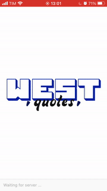
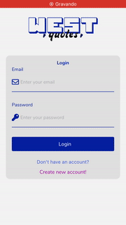
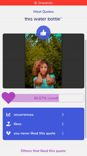
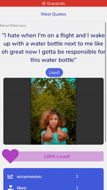
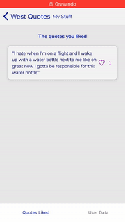
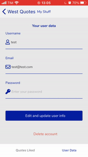
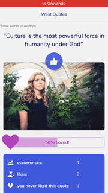

<h1 align="center">
  ❝❞ WEST QUOTES
</h1>

Simple application to get some ~~well... ok(ish)~~ awesome Kanye West quotes and a random image based on _Mr. West's_ words


<!-- Infos -->
<p align="center">
  

  

  

  
</p>

<div style="color:#333333">

### 😶 Why bother creating this?

This is an application that was developed as the final project for the mobile development course of the undergraduate course of Analysis and Systems Development from the Federal University of Parana (UFPR)

The requirements of this project envolves:
- Develop a mobile application using React Native;
- Use functional components and hooks;
- Use external APIs (third party APIs or develop it's own);
- Implement a simple login system;
- Impress the teacher.


### 🖥 How do these stuff work?

The application is divided in two parts: the mobile app and the back end (API). To get Kanye's quotes the application uses the [Kanye.REST API](https://kanye.rest/) and to get an Image it uses the [Unsplash API](https://unsplash.com/developers). In the app, the users will be able to like quotes and see info about it, like how much loved is the quote or the users that liked it. The access to the two third party APIs is done through the back end; that means the mobile application send a request for a quote to the back end, which request the quote and image to the third party APIs, then get some metadata about that quote, build a nice and fluffy json object and send it back to the mobile application (or to an web application in the future, maybe...).
In the application, when the user logs in, a random a quote from Kanye West will be displayed along with an image that is queried with some words from the quote. The user is able to Like the quote and see some data about it, like number of occurrences of the quote, how much the quote is loved and other people that liked.
Swiping the screen from left to right the user has access to the drawer menu, which contains the basic info about the logged user and buttons to navigate to User's stuff screen and to Logout. In the _My Stuff_ screen, the user has two tabs available:
- Quotes liked, where the user can see a list of quotes liked and touch in any of the quote to see some details about.
- User data, where the user can alter it's profile data, like username or email, and delete it's account.

### 🚜 What is under the hood?

Although there are several libraries involved in this application, here will be listed only the main ones:

#### Third Party APIs:
- [Kanye.REST API](https://kanye.rest/)
- [Unsplash API](https://unsplash.com/developers)

#### Backend (API):
- [Node.js](https://nodejs.org/en/)
- [Express](https://expressjs.com/pt-br/)
- [Sequelize ORM](https://sequelize.org/)

#### Mobile:
- [React Native](https://reactnative.dev/)
- [Expo](https://expo.io/)
- [React Navigation](https://reactnavigation.org/)
- [React Native Elements](https://reactnativeelements.com/)

#### General
- [NPM](https://www.npmjs.com/)


> Note: Make sure you have Node v12.* or above and NPM in command line


### 🎛 So... How to set up the environment?

As mentioned before, it's required to have Node with version 12 or above and NPM in command line. For the mobile part it's required to have the [Expo CLI](https://docs.expo.io/workflow/expo-cli/).

To run nice and soft it's needed three things:
- Have a database running and listening at some port   
- Start the server (backend)
- Start the mobile app

#### Firts things first: The application directory structure!
As you can see, this application has two main folders:
- mobile   
- server
It's recommended to have two terminal open, each one handling one of the two main parts of the application (one for the mobile and the other for the server). This means that the root folder for the mobile is inside the mobile folder and (as you probably guessed) the root folder for the server is in the server folder. So, for example, the ```.env``` file for the mobile application must be inside in ```./mobile/``` folder and the ```.env``` file for the server is placed in ```./server/``` folder.

#### About the database
- Setup some SGDB (like [Postgres](https://www.postgresql.org/) or [MySQL](https://www.mysql.com/)) - The chosen SGDB must be compatible with the Sequelize Dialects (check these [Sequelize Docs](https://sequelize.org/master/manual/dialect-specific-things.html) to see the compatibility list). Is recommended Postgres (just because it was the one used during development and everything works super nice!).
- Create a database with the name you want (the name must be informed in the Environmental Variables -  __this will be covered next__ - By default the application will look for a database named 'west_quotes').
- Make sure you have the correct address, port, name, db username and password. You will need all of this to setup the ```.env``` file (more about this file in a few moments).
- You don't need to create any tables. The table creation will be presented further.

#### Starting the server (backend)
- Check the **About the database** section and make sure the database is OK.
- Check the ```.env.example``` file in the root of the server. This file has instructions for correctly filling in the data and configuring the ```.env``` file for use by the application. Basically create a copy of the file in the same folder, rename it to only ```.env``` (just remove the ```.example``` and other suffix that can appear by coping and pasting the file) and put the info needed in the file (the info includes database name, user, host, access token secret and etc...).
- Install the dependencies of the application by running ```npm install```.
- An super important thing: To consume data from the Unsplash [Unsplash API](https://unsplash.com/developers) you need to create an account as a developer to get the **API KEY**.
- After all the setup, ou need to run the **migrations** to create the tables and, if you want, run the **seeders** to fill some data. Also you will have to decide if you want to start the server with [nodemon](https://nodemon.io/) or not (Nodemon simply monitors the server for any changes and, if it detects, will automatically restart the server). To do all these things, there are some sweet scripts in the ```package.json``` file and you can run it by entering the command ```npm run <script name>```. The main scripts are:
   
- ```start``` - Just runs the application
- ```devStart``` - Runs the application with nodemon
- ```migrations``` - Just runs the migrations
- ```seeders``` - Only runs the seeds files
- ```migrateAndStart``` - Runs the migrations and starts the server with nodemon
- ```fullStart``` - Runs migrations, seeders and then starts the server with nodemon   

So here's an example of how to install the dependencies and run the application with nodemon and with the migrations:

```bash
# In the root directory of the server (./server/):
$ npm install              # This will download and install all of the dependencies
$ npm run migrateAndStart  # This will migrate the data and run the applicaiton with nodemon
```

After that the application will be available for requests in localhost and the **port informed by you in the ```.env``` file** or in the default port 3005.

> After this section about setting up the environment, you can find the backend routes

#### Starting the mobile app
- Make sure you have the **database** and **server** running.
- Check the ```.env.example``` file in the root of the server. This file has instructions for correctly filling in the data and configuring the ```.env``` file for use by the application. Basically create a copy of the file in the same folder, rename it to only ```.env``` (just remove the ```.example``` and other suffix that can appear by coping and pasting the file) and put the info needed in the file (the only info needed so far is the backend URL that may vary according with the device you will run the application).
- Install the dependencies of the application by running ```npm install```.
- Then simple run ```expo start``` and follow instructions to run the app in an emulator or physical device that you want.

> At the final of this document, you have an Overview of the app with some gifs of the app running

### ✉️ Backend routes

The routes are segregated in three main resources:
- Main
- Quotes
- User

Each of these resources have some endpoints and http specific request methods that is described below:

> The routes that have an 🔒 are routes that you need to be authenticated to access (basically send a Bearer token in the Headers)
#### Main routes
```
GET / 🔒
Returns a quote and an image

Headers:
Authorization: Bearer <generated jwt>
```

#### User route
```
POST user/register
Returns JSON object with the the UUID of the created user

Headers:
Content-Type: application/json

Body:
{
  "username":"name_of_a_new_user,
  "email":"email_of_a_new_user,
  "password":"password_of_a_new_user"
}
```
```
POST user/login
Returns JSON object with the accessToken, refreshToken and logged user info

Headers:
Content-Type: application/json

Body:
{
  "email":"email_of_a_user,
  "password":"password_of_a_user"
}
```
```
POST user/token
Return a JSON object with a new accessToken and logged user info

Headers:
Content-Type: application/json

Body:
{
  "token":"refresh_token,
}
```
```
DELETE user/logout/:uuid
Logout the user represented by the uuid passed in the params
```
```
PUT user/ 🔒
Edits the user data according with the request body

Body:
{
  "username":"name_of_a_new_user,
  "email":"email_of_a_new_user,
  "password":"password_of_a_new_user"
}

Headers:
Authorization: Bearer <generated jwt>
```
```
DELETE user/ 🔒
Deletes the account of the user logged

Headers:
Authorization: Bearer <generated jwt>
```
#### Quote route
```
GET quote/ 🔒
Returns JSON object with an array of the quotes liked by the user logged

Headers:
Authorization: Bearer <generated jwt>
```
```
GET quote/:uuid 🔒
Returns JSON object with the details of the quote represented by the uuid in the params

Headers:
Authorization: Bearer <generated jwt>
```
```
PUT quote/:uuid 🔒
Mark the quote represented by the uuid in the params as liked by the user logged

Authorization: Bearer <generated jwt>
```
```
DELETE quote/:uuid 🔒
Remove the quote represented by the uuid in the params from the quotes's like list of the user logged
```

### 🔭 Application Overview
Here are some samples of the application in use

Fig 1 - Splash screen and Register screen



Fig 2 - Creating a new account



Fig 3 - Showing a quote and liking it



Fig 4 - User's stuff



Fig 5 - Showing a quote detail and disliking the quote



Fig 6 - Editing user's data

   

Fig 7 - Logout


Fig 8 - Deleting account



</div>